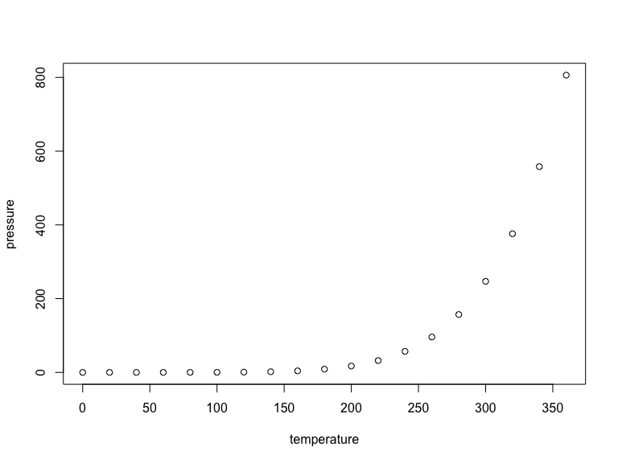

TIMBY Cleaning and EDA
================
Jake William Coldiron
22 July 2024

``` r
#importing the data 

timby_juvenile_general_information = read_xlsx("./timby_analysis_data/timby_excel_complete.xlsx", 1) |> 
  
  clean_names() |> 
  
  mutate(service_provider = to_snake_case(as.character(service_provider))) |>  
  
  mutate(placement = to_snake_case(as.character(placement))) |> 
  
  separate(placement, into = c("location", "facility_type")) |> 
  
  select(-pde_completed_date_time)
  

print(timby_juvenile_general_information)
```

    ## # A tibble: 68 × 4
    ##    juvenileid location      facility_type service_provider
    ##         <dbl> <chr>         <chr>         <chr>           
    ##  1     502065 eastman       ydc           psychiatrist    
    ##  2     507211 milledgeville ydc           psychologist    
    ##  3     509322 atlanta       ydc           psychiatrist    
    ##  4     524787 atlanta       ydc           psychiatrist    
    ##  5     530297 eastman       ydc           psychiatrist    
    ##  6     536581 atlanta       ydc           psychologist    
    ##  7     537118 atlanta       ydc           psychologist    
    ##  8     542732 dekalb        rydc          psychiatrist    
    ##  9     543361 metro         rydc          psychiatrist    
    ## 10     545353 columbus      rydc          psychiatrist    
    ## # ℹ 58 more rows

``` r
#view(timby_juvenile_general_information)
```

This is an R Markdown document. Markdown is a simple formatting syntax
for authoring HTML, PDF, and MS Word documents. For more details on
using R Markdown see <http://rmarkdown.rstudio.com>.

When you click the **Knit** button a document will be generated that
includes both content as well as the output of any embedded R code
chunks within the document. You can embed an R code chunk like this:

``` r
summary(cars)
```

    ##      speed           dist       
    ##  Min.   : 4.0   Min.   :  2.00  
    ##  1st Qu.:12.0   1st Qu.: 26.00  
    ##  Median :15.0   Median : 36.00  
    ##  Mean   :15.4   Mean   : 42.98  
    ##  3rd Qu.:19.0   3rd Qu.: 56.00  
    ##  Max.   :25.0   Max.   :120.00

## Including Plots

You can also embed plots, for example:



Note that the `echo = FALSE` parameter was added to the code chunk to
prevent printing of the R code that generated the plot.
